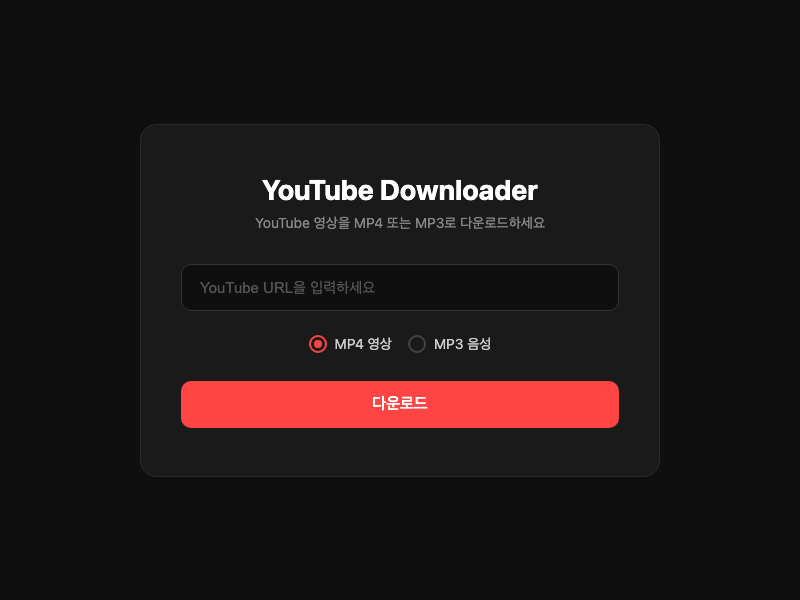

# YouTube Downloader

YouTube 영상을 MP4(영상) 또는 MP3(음성)로 다운로드할 수 있는 웹앱입니다.



## 기능

- YouTube URL 입력으로 간편 다운로드
- MP4 영상 / MP3 음성 포맷 선택
- 파일명 자동 생성: `YT-채널이름-영상제목.확장자`
- 다운로드 후 임시 파일 자동 정리
- 다크 테마 반응형 UI

## 기술 스택

- **Backend**: Python Flask + yt-dlp
- **Frontend**: HTML / CSS / JS (단일 페이지)

## 설치 및 실행

```bash
# 의존성 설치
pip install -r requirements.txt
pip install "yt-dlp[default]"

# 서버 실행
python3 app.py
```

브라우저에서 `http://localhost:5001` 접속

## 요구 사항

- Python 3.10+
- Node.js 20+ (yt-dlp JS 챌린지 해결용)
- FFmpeg (MP3 변환용)

## 프로젝트 구조

```
ytDownloader/
├── app.py              # Flask 서버
├── templates/
│   └── index.html      # 프론트엔드 UI
├── static/
│   └── style.css       # 스타일시트
├── downloads/          # 임시 다운로드 폴더
└── requirements.txt    # Python 의존성
```
